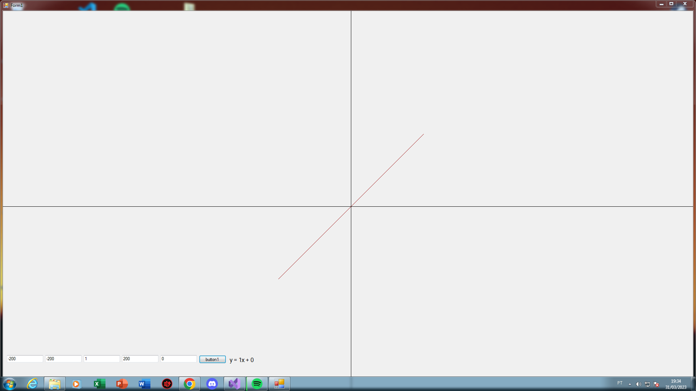
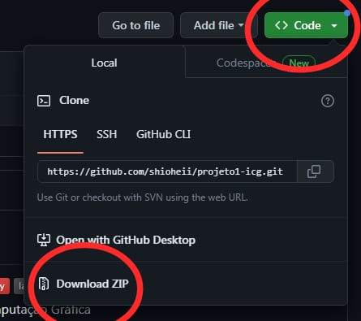

# projeto1-icg
<a href="https://github.com/shioheii">
  
</a>
<a href="#">
  
</a>
<a href="#">
  
</a>
<a href="#">
  
</a>
<a href="#">
  
</a><br />

Projeto do primeiro bimestre na matéria de Introdução a Computação Gráfica

## Sobre o projeto
A proposta do projeto era desenvolver um sistema simples, para fazer retas em um eixo cartesiano, onde o usuário insere alguns valores de entrada: x e y inicial, que seriam referente ao primeiro ponto, o coeficiente angular, valor de x final e o coeficiente linear, para que com esses 3 últimos valores seria possível calcular o valor de y final e montar a reta.



## O que aprendi?
Aprendi a utilizar na prática, os conceitos de primitivas gráficas no desenvolvimento deste projeto.

## Recursos utilizados
- Linguagem: C#
- Ferramenta/IDE: [Visual Studio](https://visualstudio.microsoft.com/pt-br/)

## Executar projeto na sua máquina:
Para executar este projeto no seu computador, basta clicar em "Code" e depois em "Download ZIP":


Ou clone o repositório pelo link:
```bash
$ git https://github.com/shioheii/projeto1-icg.git
```

Então execute o arquivo "projeto.sln" que é a solução do projeto.

Observação: O projeto foi desenvolvido para um monitor de resolução 1920 x 1080, então é provável que não funcione adequadamente para outras resoluções.

---

<p align="center">
  <a alt="Bruno Shiohei Kinoshita do Nascimento Linkedin" href="https://www.linkedin.com/in/bruno-shiohei/">
    
  </a>
  <a alt="Bruno Shiohei Kinoshita do Nascimento GitHub" href="https://github.com/shioheii">
    
  </a>
</p>
